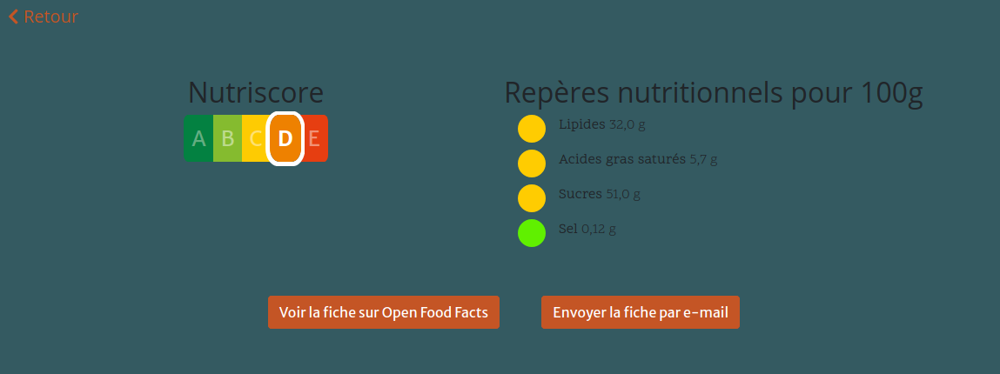
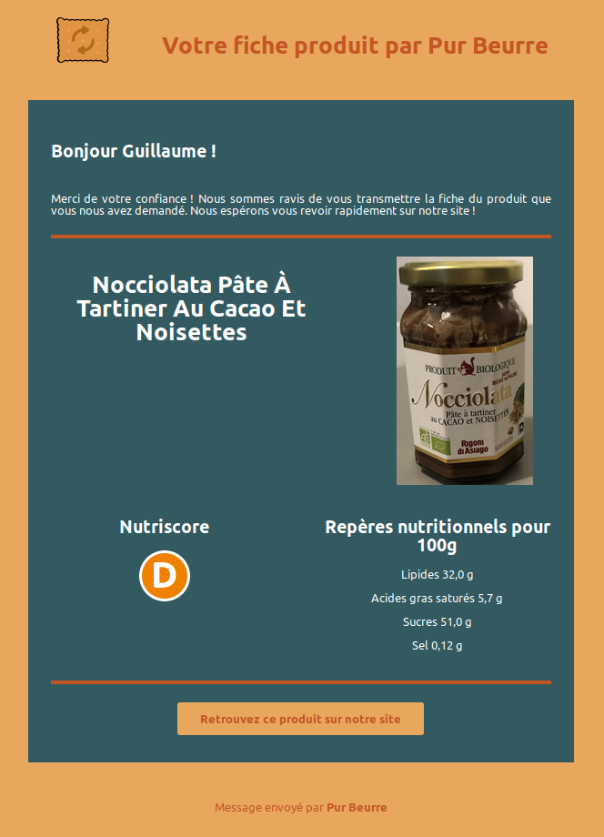

Bonjour madame Jimena,

Comme convenu la semaine dernière, veuillez trouver ci-après le lien vers les commits de la nouvelle fonctionnalité.

Il s'agit des commits [59f6f72](https://github.com/GuillaumeOj/P11-AddAFeature/commit/59f6f7260932de94e0e64134d44642133977241b) et [84b2dde](https://github.com/GuillaumeOj/P11-AddAFeature/commit/84b2dde8f1f6dceb9cbc62b7005de7795fd00cc7).

Désormais, l'utilisateur peut cliquer sur un bouton lui permettant de recevoir la fiche du produit consulté par e-mail.
Vous trouverez ci-après des captures d'écran du résultat :

Cordialement,

Guillaume OJARDIAS.
